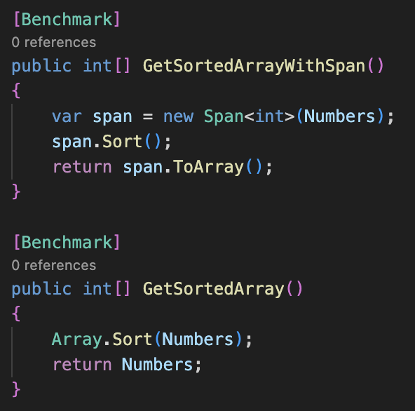
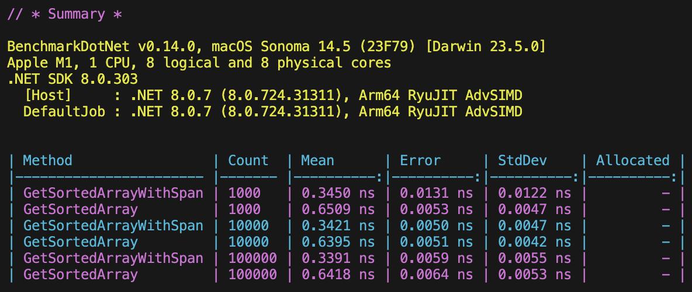

# How to speed up array sorting in C# by two times

## TL;DR
Try using [Span<T>](https://learn.microsoft.com/en-us/dotnet/api/system.span-1).

## Details
Using `Span<T>` can optimize the performance of sorting an array by eliminating the need for unnecessary memory allocations and copies.

`Span<T>` provides a lightweight view into a contiguous region of memory, allowing you to work directly with the underlying data without creating additional arrays or buffers. This means that when sorting an array using `Span<T>`, you can avoid the overhead of creating temporary arrays or copying elements between arrays.

By using `Span<T>`, you can perform in-place sorting operations, which can significantly improve the performance of sorting algorithms. In-place sorting modifies the original array directly, eliminating the need for additional memory allocations and reducing the overall memory footprint.

Additionally, `Span<T>` provides efficient slicing and indexing operations, allowing you to easily partition and access specific portions of the array. This can be particularly useful when implementing sorting algorithms that require dividing the array into smaller subarrays.

Overall, by leveraging `Span<T>` in your sorting algorithms, you can achieve better performance by minimizing memory allocations, reducing copying overhead, and enabling efficient array manipulation operations.

## Benchmarking summary

